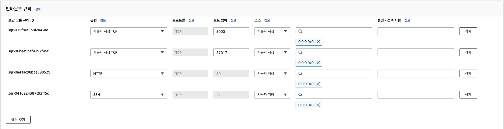

# AWS EC2에 mongoDB 데이터베이스 생성하기

## EC2에서의 mongoDB 데이터베이스 구축 과정 정리

install guide:  
[https://www.mongodb.com/docs/manual/tutorial/install-mongodb-on-ubuntu/](https://www.mongodb.com/docs/manual/tutorial/install-mongodb-on-ubuntu/)

> 📌 AWS EC2 Ubuntu 22.04 LTS ("Jammy") 버전을 기준으로 작성되었습니다.

---

### [ubuntu initialize]

EC2 ubuntu에는 기본적으로 파이썬 3.10 버전이 설치되어 있으니 버전 문제가 없다면 그대로 쓰면 됩니다.  
아래 코드는 사용의 편의를 위한 우분투 초기화에 해당한다.

1. 인스턴스를 한국 시간으로 설정하기
2. 터미널에서 python을 입력하면 python3를 입력한 것으로 인식시키기
3. 터미널에서 pip를 입력하면 pip3를 입력한 것으로 인식시키기
4. 웹에서 80번 포트로 접속하면 5000번 포트로 리다이렉트 시켜주기

   ```bash
   # UTC to KST
   sudo ln -sf /usr/share/zoneinfo/Asia/Seoul /etc/localtime

   # python3 -> python
   sudo update-alternatives --install /usr/bin/python python /usr/bin/python3 10

   # pip3 -> pip
   sudo apt-get update
   sudo apt-get install -y python3-pip
   pip3 --version
   sudo update-alternatives --install /usr/bin/pip pip /usr/bin/pip3 1

   # port forwarding
   sudo iptables -t nat -A PREROUTING -i eth0 -p tcp --dport 80 -j REDIRECT --to-port 5000
   ```

특히 한국시간 설정은 mongoDB와 같은 특정 데이터베이스에 현재 시간을 입력해야하는 경우에 대비하여 설정이 필요합니다.  
예를 들어 python의 datetime.now()를 사용할 경우 PC의 현재 시각 정보를 가져오기 때문에 내 컴퓨터(혹은 인스턴스)가 한국 기준의 시각으로 설정되지 않았다면 현재 서버가 위치한 곳의 시각이 기준이 될 수도 있다.

### [install MongoDB]

**Import the public key used by the package management system**

```bash
sudo apt-get install gnupg
```

```bash
curl -fsSL https://pgp.mongodb.com/server-6.0.asc | \
   sudo gpg -o /usr/share/keyrings/mongodb-server-6.0.gpg \
   --dearmor
```

**Create a list file for MongoDB**

> 해당 명령은 curl을 사용하여 MongoDB의 공개 키를 다운로드하고, 다운로드된 공개 키를 GPG(GNU Privacy Guard)를 사용하여 디코딩 및 변환하는 명령입니다.  
> 상세한 설명은 다음과 같습니다:  
> curl -fsSL [https://pgp.mongodb.com/server-6.0.asc](https://pgp.mongodb.com/server-6.0.asc): curl을 사용하여 [https://pgp.mongodb.com/server-6.0.asc에서](https://pgp.mongodb.com/server-6.0.asc%EC%97%90%EC%84%9C) MongoDB 서버 6.0의 공개 키를 다운로드합니다.  
> \-fsSL 옵션은 실패 시 오류 메시지를 표시하지 않고, SSL 인증서 검증을 비활성화하고, 서버로 리디렉션을 따라가도록 설정합니다.  
> sudo gpg -o /usr/share/keyrings/mongodb-server-6.0.gpg --dearmor: 다운로드한 공개 키를 GPG를 사용하여 /usr/share/keyrings/mongodb-server-6.0.gpg 파일로 디코딩하고 변환합니다.  
> \--dearmor 옵션은 GPG 키를 바이너리 형식에서 ASCII 형식으로 변환합니다.  
> 이 명령은 MongoDB의 공개 키를 다운로드하여 시스템에 등록하는 과정을 수행합니다. 이를 통해 시스템에서 MongoDB의 패키지를 검증할 수 있게 됩니다.

```bash
echo "deb [ arch=amd64,arm64 signed-by=/usr/share/keyrings/mongodb-server-6.0.gpg ] https://repo.mongodb.org/apt/ubuntu jammy/mongodb-org/6.0 multiverse" | sudo tee /etc/apt/sources.list.d/mongodb-org-6.0.list
```

**Reload local package database**

```bash
sudo apt-get update
```

**Install the MongoDB packages.**

```bash
sudo apt-get install -y mongodb-org
```

### [EC2 보안그룹 - 인바운드 규칙 수정]

포트번호를 열어주는 과정입니다. 특히 mongoDB의 경우 27017 포트번호를 사용하기 때문에 해당 포트를 열어줘야 외부에서 데이터 적재를 위한 접근이 허용됩니다.

> MongoDB Port:27017



### \[Start MongoDB\]

> mongodb를 실행하고 status를 통해 연결이 잘 되었는지 확인합니다.

```bash
sudo service mongod start
sudo service mongod status
```

정상 작동 시 status 결과에서 Active 란에 active(초록색)이 들어와야 합니다.

```
● mongod.service - MongoDB Database Server
     Loaded: loaded (/lib/systemd/system/mongod.service; enabled; vendor preset: enabled)
     Active: active (running) since Fri 2023-05-19 11:54:37 KST; 4h 28min ago
       Docs: https://docs.mongodb.org/manual
   Main PID: 5501 (mongod)
     Memory: 120.6M
        CPU: 1min 4.443s
     CGroup: /system.slice/mongod.service
             └─5501 /usr/bin/mongod --config /etc/mongod.conf

May 19 11:54:37 ip-172-31-32-40 systemd[1]: mongod.service: Deactivated successfully.
May 19 11:54:37 ip-172-31-32-40 systemd[1]: Stopped MongoDB Database Server.
May 19 11:54:37 ip-172-31-32-40 systemd[1]: mongod.service: Consumed 3.345s CPU time.
May 19 11:54:37 ip-172-31-32-40 systemd[1]: Started MongoDB Database Server.
May 19 11:54:37 ip-172-31-32-40 mongod[5501]: {"t":{"$date":"2023-05-19T02:54:37.966Z"},"s":"I",  "c":"CONTROL",  "id":7484500, "ctx":"-","msg":"Environment variable MONGODB_CONFIG_OVERRIDE_NOFORK == 1, overriding \"processManagement.fork\" to false"}
```

> 💡 `Tip`  
> 어떠한 문제로 인해 mongod.service: Failed with result 'exit-code'.와 같은 경고가 뜨면서 Active 되지 않을 경우 /tmp/mongodb-27017.sock 이 경로의 파일을 삭제해 볼것을 추천합니다.

### [Set Database]

`/etc/mongod.conf` 파일을 열어서 아래와 같이 수정합니다.

1.  bindIp 를 127.0.0.1에서 0.0.0.0 으로 수정
2.  security 활성화 및 `authorization: enabled` 입력

```
# network interfaces
net:
port: 27017
bindIp: 0.0.0.0

security:
authorization: enabled
```

127.0.0.1은 localhost IP로 나 이외의 컴퓨터에는 데이터베이스에 접속이 불가한 상태를 의미하지만 전부 0으로 바꾸면 누구나 접속할 수 있는 상황이 됩니다. 하지만 이렇게 되면 전 세계의 서버 침투봇이 자유롭게 내 서버에 드나들게 되도록 허용하는 것이기 때문에 이를 방어하기 위한 authorization 설정도 필요합니다.

MongoDB에 접속하여 유저 생성을 합니다.

```bash
# MongoDB 접속
mongosh
```

```bash
# 어드민 계정 접속
use admin
```

```bash
# 외부 접속용 계정 생성
db.createUser({user: "input", pwd: "input", roles:["root"]});
```

admin 계정으로 사용자 계정을 생성합니다. user 란과 pwd란의 "input"을 원하시는 값으로 변경합니다. 그리고 반드시 기억해야 합니다.  
roles는 사용자 권한설정을 의미합니다. (root 권한은 뭐든지 할 수 있는 관리자 권한임음을 뜻합니다.)

> 💡 `Tip`  
> mongoDB 설치 및 연결 후 가장 처음으로 사용자 계정 설정을 할 경우 별다른 인증 절차가 없었을 것입니다.  
> 하지만 이후부터 계정 생성 및 사용자정보 보기 등의 명령을 위해서는 인증 절차가 필요합니다.  
> 최초 생성한 유저가 곧 관리자가 되었고, 이제 관리자의 권한이 없으면 계정 생성 등이 제한되는 것이죠.
>
> 이후에는 use admin 입력 후 db.auth("사용자명", "사용자패스워드")를 입력하여 { ok: 1 } 사인을 받아야 권한이 부여됩니다.

```bash
#mongoDB 나오기
exit
```

```bash
#mongoDB 재시작
service mongod restart
```

### python으로 DB 접속 테스트해보기

아래 코드에서 user와 pwd, 그리고 ec2에 할당된 IP주소를 입력합니다.  
위 코드가 정상작동한다면 `[{'_id': ObjectId('6467297316acc6e3d44187b9'), 'test': 1234}]`와 같이 데이터가 잘 출력되어야 합니다. 이제 해당 서버는 데이터베이스 저장소가 되었고 기본적으로 `/var/lib/mongodb`경로에 데이터가 저장됩니다.

```python
from pymongo import MongoClient

def run():
    client = MongoClient('mongodb://<user>:<pwd>@<ec2 Public IPv4>', 27017)

    db = client.test
    db.testcollection.insert_one({'test': 1234})

    test_data = list(db.testcollection.find({}))
    print(test_data)

if __name__ == "__main__":
    run()
```

위 코드는 mongoDB 접속 후 test라는 데이터베이스에 testcollection이라는 컬렉션에 접속하여 'test': 1234라는 데이터를 입력한 뒤 testcollection이라는 컬렉션에 담긴 데이터를 전부 가져와서 print하라는 명령입니다. 즉 데이터가 잘 들어가고 나오는지 확인한 것입니다.
