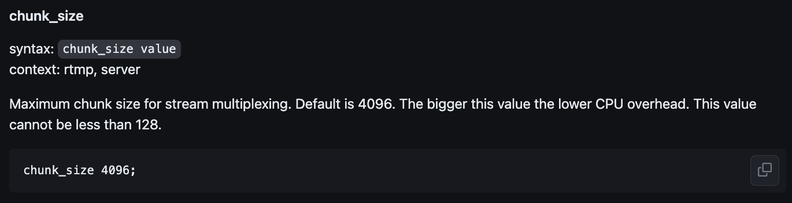
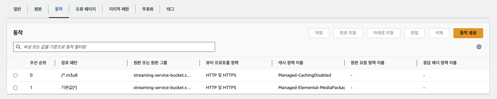
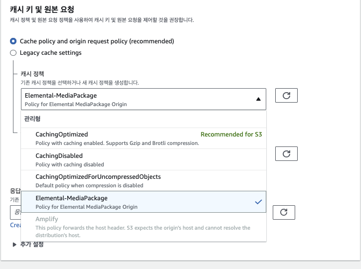

# AWS S3, cloudfront로 라이브 스트리밍 구현

라이브 스트리밍 페이지 구현 프로젝트에서 rtmp 프로토콜과 hls 기술을 활용하였다.

OBS와 같은 라이브 방송용 프로그램으로 rtmp://내IP주소/스트림키:1935 연결을 설정한 후 방송 시작을 클릭하면 해당 방송이 그대로 지정한 rtmp프로토콜로 흘러 들어온다.  
이 때 실시간으로 들어오는 데이터를 하나의 파일로 저장하기 보다는 어느정도 일정한 간격으로 깍뚝썰기 하듯 조각 단위로 저장을 하는데 이렇게 하는 방식을 트랜스 먹싱이라고 부르며 대표적으로 hls 기술이 이를 구현한다.

간단하게 말해서 실시간으로 흘러들어오는 영상을 마치 가래떡 뽑는 기계에서 일정 간격으로 떡 자르듯 조각내어 파일로 저장하는 방식이라 할 수 있겠다.

javascript 기반 라이브 스트리밍 프로젝트에 도전하면서 nodejs에서는 'node-media-server'라는 node 패키지를 사용하여 실시간 미디어 서버를 간단하게 구현할 수 있었다.
[GitHub 페이지 참조](https://github.com/illuspas/Node-Media-Server)

하지만 추가적으로 nginx에서 작동하는 rtmp 패키지도 발견하여서 이 둘을 모두 테스트해 봤으며, 프로젝트 기간을 고려했을 때 편리한 측면에 있어서는 node-media-server라는 패키지가 한 수 위였기에 해당 패키지를 채택하여 프로젝트를 진행했다. 하지만 nginx 기반 라이브 스트리밍 구현도 함께 도전 중이다.
[GitHub 페이지 참조](https://github.com/arut/nginx-rtmp-module)

```javascript
// app.js

const config = {
  rtmp: {
    port: 1935,
    chunk_size: 4096,
    gop_cache: true,
    ping: 30,
    ping_timeout: 60,
  },
  http: {
    port: 8000,
    mediaroot: './media',
    allow_origin: '*',
  },
  trans: {
    ffmpeg: '/usr/bin/ffmpeg',
    tasks: [
      {
        app: 'live',
        hls: true,
        hlsFlags: '[hls_time=1:hls_list_size=100:hls_flags=delete_segments]',
        hlsKeep: false, // to prevent hls file delete after end the stream
        // dash: true,
        // dashFlags: "[f=dash:window_size=3:extra_window_size=5]",
        // dashKeep: false, // to prevent dash file delete after end the stream
      },
    ],
  },
};

const nms = new NodeMediaServer(config);
nms.run();
```

Task Flow가 코드로 쉽게 구현되어 있다. 먼저 기본적으로 rtmp의 port, chunk_size를 설정한다. port는 1935로 rtmp 프로토콜 사용 시 default값으로 설정하는 포트인 것으로 보였다. 그렇기에 rtmp프로토콜을 쓴다면 1935포트를 따로 입력하지 않아도 잘 작동한다. 마치 우리가 https프로토콜을 쓰면서 443포트 번호를 따로 기입하지 않는 것과 같다.

chunk_size는 개인적으로 buffer size와 같은 말로 이해했다.  
Logic Pro와 같은 음악 제작 프로그램에서도 이와 같은 단위가 있는데 이는 실시간으로 입력되는 데이터를 CPU가 내부적으로 전송할 때 얼마만큼의 데이터 양이 축적되면 전달할지 결정하는 단위이다.

## chunk_size에 대해서



위 글은 nginx용 rtmp프로토콜 송수신을 지원하는 github wiki에서 가져온 정보인데 위 설명과 같이 해당 값이 상대적으로 작아질수록 CPU의 부담이 높아진다. 왜냐하면 낮은 데이터량이 축적된다면 CPU가 자주 일해야 하고, 높은 데이터량이 축적된다면 상대적으로 덜 움직여도 되기 때문이다. 이러한 점에는 장단점이 있는데 그것을 바로 `Latency`와 연관이 있다.

레이턴시는 일종의 반응 속도와 뉘앙스가 비슷한 것 같다. 우리가 만약 저렴한 블루투스 이어폰으로 넷플릭스를 본다면 말소리가 입모양이 미묘하게 늦는 것을 경험할 수 있는데 이러한 현상을 놓고 레이턴시가 좀 있다고도 말한다. 그리고 그 간격이 심해질수록 레이턴시가 높다고 말한다.

그렇다면 라이브 스트리밍 중에는 buffer size가 높은 것이 좋을까 낮은 것이 좋을까? 당연히 낮을 수록 좋다. 만약 높다면 스트리밍에 버퍼링이 발생할 수 있다. 다음 영상 조각을 프론트에 넘겨줘야 하는데 준비가 덜 되었다며 기다리라고 하는 것과 같기 때문이다.

그렇다고 해서 buffer size가 무조건 낮출 수 만은 없다. 그 이유는 바로 CPU가 힘들어 하기 때문이다. 위 설명에서도 언급된 바와 같이 buffer size가 낮을 수록 오버헤드가 발생, 즉 CPU가 무리하게 된다. 마치 택배 기사님이 205호에 온 택배 상자 10개를 하나씩 10번 배달하는 것 vs 10개를 한 번에 배달하는 것과 같다. 한 박스씩 10번 배달한다면 205호 주인은 한 상자씩 지속적으로 열어볼 수 있겠지만 택배 아저씨는 기절할 수도 있다. 반대로 10개의 상자를 한 번에 가져가려면 큰 수레에 담는 시간이 필요할 것이다. 그 수레에 박스가 모두 담기기 전까지 205호 주인은 단 한박스로. 미리 받아볼 수 없다.

그러므로 buffer size는 주어진 환경에 따라 trade-off가 필요한 영역이다. 우리 프로젝트의 경우 실시간 라이브 스트리밍 이지만 실제 현실과 방송의 간극이 약 20초 정도 발생한다 하더라도, 내가 말한 내용이 20초 뒤에 시청자에게 전해지는게 문제가 없다면 chunk_size를 높여도 되겠다. 하지만 시청자와의 실시간 소통, 티키타카가 중요하다면 20초의 딜레이는 치명적일 수 있다.

http의 경우 8000번 포트로 접속 시 root 디렉토리를 바라보도록 설정했다. 해당 디렉토리에서 내부적으로 hls 파일들이 쌓이게 되므로 해당 포트로 접근하여 스트리밍 영상 파일을 실행하게 된다.

마지막으로 trans에서는 ffmpeg 패키지를 활용하여 hls 방식으로 스트리밍 영상을 조각내서 저장한다. 내부적으로는 .m3u8 파일과 .ts 파일들이 생성되는데 ts파일은 영상의 조각들을 의미하고, m3u8은 각 조각들의 실행 순서를 가이딩 해주는 플레이리스트에 해당 한다. 내부 옵션을 통해 조각의 크기 한도를 지정하거나, 조각의 자동삭제 타이밍 등을 설정할 수 있다. 스트리밍이 길어질수록 .ts파일의 개수가 쌓여갈텐데 이는 이미 지난 과거에 해당하는 파일들이므로 필요없다면 환경에 따라 정기적으로 지워주는 것이 컴퓨팅 자원 관리 측면에서 좋을 수 있다.

## s3에 hls 파일 업로드

현재 node-media-serve 패키지를 사용한다면 일단 로컬에 hls파일들(.m3u8, .ts)이 저장된 이후 s3 버킷에 업로드 하는 방식으로 진행해야 한다. 중간에 가로채기 위해 내부 코드를 어느 정도 뜯어보기도 했지만 프로젝트 기간을 생각해서 차선책을 택했다. 무엇보다 `chokidar` 이라는 패키지를 활용한다면 지정 디렉토리 내 새 파일이 생성되면 알려주는 이벤트 리스너를 간단하게 구현할 수 있었다. 그래서 이를 활용하여 즉시 s3로 업로드 하도록 코드를 간단히 구현했다. (버킷 생성은 생략한다.)

```javascript
// app.js

const s3 = new AWS.S3({
  accessKeyId: process.env.AWS_ACCESS_KEY_ID,
  secretAccessKey: process.env.AWS_SECRET_ACCESS_KEY,
  region: process.env.AWS_S3_REGION,
});

const uploadFileToBucket = (filePath) => {
  const fileContent = fs.createReadStream(filePath);
  const fileName = path.basename(filePath);
  const folderNames = path.dirname(filePath).split('/');
  const folderName = folderNames[folderNames.length - 1];

  const params = {
    Bucket: process.env.AWS_S3_BUCKET,
    Key: `videos/${folderName}/${fileName}`
    Body: fileContent,
  };
  s3.upload(params, function (err, data) {
    if (err) throw err;
    console.log(`File uploaded: ${data.Location}`);
  });
};
```

먼저 파일 경로를 넘겨주면 해당하는 파일을 버킷에 담아주는 간단한 함수이다. 받아온 절대경로를 활용하여 버킷에서의 경로를 지정한다.  
key 부분이 직접적인 버킷 저장 경로, 파일 이름 지정란이 되겠다.

```javascript
// app.js

const baseDirectory = './media/live'; // Modify this path to your base directory

const chokidar = require('chokidar');
const watcher = chokidar.watch(baseDirectory, {
  ignored: /(^|[\/\\])\../, // Ignore dotfiles
  persistent: true,
  depth: 10, // Set the depth for recursive watching
});
```

위 패키지를 통해 watcher 변수를 생성하여 감시 대상 디렉토리를 지정한 뒤

```javascript
// app.js

watcher
  .on('add', (filePath) => {
    const streamPath = path.relative(baseDirectory, filePath); // id/index.ts(m3u8)
    const streamDirectory = streamPath.split('/')[0]; // id
    const playlistFilePath = path.join(baseDirectory, streamDirectory, 'index.m3u8'); // media/live/id/index.m3u8

    uploadFileToBucket(filePath);
    uploadFileToBucket(playlistFilePath);
  })

  .on('error', (error) => {
    console.error(`Watcher error: ${error}`);
  });
```

지정 디렉토리의 파일이 생성되면 해당 파일을 버킷에 업로드 했다. 여기서 주목할 점은 `index.m3u8` 파일을 지속적으로 반복 저장하고 있다는 점이다. filePath의 경우 지속적으로 신규 생성되는 .ts파일을 가리킨다. 즉 영상 조각이 스트리밍이 끝날 때 까지 계속 생성되고, 그렇다면 플레이리스트 역할인 .m3u8은 지속적으로 플레이 리스트를 최신화 해야 할 것이다. 그렇기 때문에 .ts파일이 생성될 때 마다 정보가 바뀌는 .m3u8을 지속적으로 함께 업로드 하는 것이다. 그렇지 않으면 .m3u8은 맨 처음 딱 한번만 저장되기 때문이다. 그 이유는 watcher가 이미 존재하는 파일이 덮어씌어지는 것에 대해서는 반응하지 않기 때문이다.

업로드에 정상적으로 성공했다면 .m3u8 파일을 hls player로 실행하면 정상적으로 스트리밍이 재생될 것이다.

## cloudfront와 연결하기

[참조 글](https://docs.aws.amazon.com/ko_kr/AmazonS3/latest/userguide/tutorial-s3-cloudfront-route53-video-streaming.html#cf-s3-step4-create-cloudfront)

해당 파트에서 비교적 애를 먹었다.  
먼저 cloudfront를 고려하는 이유는 비용과 캐싱 기능이 가장 크다. 들어오는 모든 웹 사이트 요청은 네트워크 대역폭을 사용하기 때문에 대역폭 비용이 상당히 높은데, 캐싱 및 기타 최적화를 통해 CDN은 오리진 서버가 제공해야 하는 데이터의 양을 줄여 웹 사이트 소유자의 호스팅 비용을 절감할 수 있기 때문이다. 즉 라이브 스트리밍에서 더 많은 시청자가 오리진 서버인 S3까지 들르지 않고 지리적으로 가까운 서버의 캐시 전송을 받아 트래픽 감소를 방지할 수 있다.

S3와 cloudfront를 연결한다면 아래 항목에 집중해야 한다.

- cloudfront 배포 생성
- s3에게 cloudfront 접근을 허용하도록 버킷 정책 수정
- CORS 구성
- 캐시 정책 설정

1. 먼저 cloudfront 배포는 오리진 도메인을 본인이 가진 s3를 선택하여 생성해주면 된다 이때 캐시 정책을 선택해야 하는데 이 부분은 뒤에서 좀 더 자세히 설명하겠다.
2. 다음으로 배포 생성 후 버킷 정책을 제공받게 되는데 해당 내용을 s3 버킷 정책에 복사해 준다. (해당 자료는 AWS에서 직접 제공해 주므로 사이트를 참조할 것, 추후 변동될 수 있음)

```json
{
  "Version": "2008-10-17",
  "Id": "PolicyForCloudFrontPrivateContent",
  "Statement": [
    {
      "Sid": "AllowCloudFrontServicePrincipal",
      "Effect": "Allow",
      "Principal": {
        "Service": "cloudfront.amazonaws.com"
      },
      "Action": "s3:GetObject",
      "Resource": "arn:aws:s3:::streaming-service-bucket/*",
      "Condition": {
        "StringEquals": {
          "AWS:SourceArn": "arn:aws:cloudfront::354241744074:distribution/E1G61FQGCYOAMC"
        }
      }
    }
  ]
}
```

3. CORS 구성은 미디어 서버가 다른 도메인 서버와 통신하기 위해 필요한 설정이다. 기본적으로 CORS가 Allowed 설정이 되어있지 않은 서버와는 통신이 막힌다.  
   이번 프로젝트의 경우에도 라이브 스트리밍을 위한 페이지가 존재하므로 이와 미디어 서버 간 API 통신을 위해서 아래와 같이 설정했다. 이 설정이 없다면 크롬 콘솔에서 CORS에 대한 경고를 만날 수 있다.

```json
[
  {
    "AllowedHeaders": ["*"],
    "AllowedMethods": ["GET", "HEAD"],
    "AllowedOrigins": ["*"],
    "ExposeHeaders": ["x-amz-server-side-encryption", "x-amz-request-id", "x-amz-id-2"],
    "MaxAgeSeconds": 3000
  }
]
```

## 캐시 정책은 왜 필요할까?

그 전에 우리가 S3를 cloudfront와 엮은 이상 라이브 스트리밍 시청자는 S3가 아닌 캐시에 접근한다는 사실을 알아야 한다. 하지만 중요한 점은 `원본 파일이 업데이트 되었을 때 캐시 파일에 즉각 반영이 되어야 한다는 점`이다. 가령 웹 서버의 index.html 파일을 수정한 뒤 S3에 업로드 했다고 하자. 그러면 index.html이라는 기존 파일이 덮어씌어진 상태이기 때문에 캐시가 S3의 원본에 접근하지 않고 이미 보유 중인 캐시를 유저에게 제공할 수 있다. 그러면 문제가 발생할 수 있다. 이렇게 캐시는 언제 업데이트 되어야 하는가? 어떤 데이터는 캐시에 포함시키지 않아야 하는가 등의 고민을 담는 곳이 캐시 정책이라고 볼 수 있다.

우리 프로젝트의 경우 m3u8파일이 항상 index.m3u8이라는 이름을 가지고, .ts 파일도 늘 index0.ts, index1.ts... 이렇게 쌓여가는 구조였다. 그러므로 예전 파일과 최신 파일이 캐시에 뒤섞여 스트리밍 되는 기이한 현상이 벌어지기도 했다.

위에서 잠깐 언급했지만 ts파일(영상 조각)이 생성될 때 마다 m3u8파일 내용이 갱신된다. 하지만 캐시에 등록되는 때는 딱 한번 신규 생성되었을 때 뿐이다. 그 이후로는 캐시만 참조하기 때문에 m3u8에서 최신화 정보를 가져오지 못하는 현상이 발생했다. 이 모든게 캐시의 최신화가 빠릿빠릿하지 않아서 발생한 문제였다.

이를 해결하는 방법은 의외로 간단했다. 바로 /.m3u8 파일만 항상 오리진을 참조하도록 하고 나머지 ts 파일은 캐시를 참조하도록 설정하는 것이었다.



위 사진에서 보는 것과 같이 내가 생성한 cloudfront의 동작 탭에서 m3u8에 `Managed-CachingDisabled` 정책을 적용하여 캐싱 사용을 금지한 것을 볼 수 있다. 그 다음 우선 순위로 나머지 파일은 캐싱하도록(Managed-Elemental-MediaPackage) 한다. 오른편에 우선순위 번호에 따라 순차적으로 정책이 수행된다는 것을 기억하자



이처럼 기본적으로 추천하는 정책 종류가 나열되어 있다. 처음에는 recommended가 붙은 `CachingOptimized`정책을 선택했더니 ts 파일 캐시가 바로바로 변경되지 않았고, 이를 `Elemental-MediaPackage`로 정책을 변경했더니 매 링크 접속 시 캐시가 금방금방 잘 최신화 되는 것을 확인할 수 있었다.

## 무효화 생성(즉각 캐싱 최신화)

해당 기능은 즉시 캐시를 삭제하는 기능을 담고 있다.  
무효화(Invalidate)는 Cloudfront의 엣지 로케이션에 저장된 파일의 캐시를 삭제하는 기능으로, 캐시가 삭제되면 엣지 로케이션이 origin으로부터 새 파일을 받아오기 때문에 자연히 최신화가 되는 구조이다.

해당 기능은 웹 서버 최신화에 후 즉시 사용하기에 용이할 것 같다는 생각이 들었다. 먄악 index.html 파일을 수정했다면 굳이 캐시 최신화가 잘 될지 걱정할 바에 해당 캐시를 삭제하는게 속편할 수 있기 때문이다. 하지만 당연하게도 지속적으로 ts파일이 업로드 되는 라이브 스트리밍은 무효화 생성 사용이 불가한데 다행스럽게도 `Elemental-MediaPackage` 정책이 있었기에 일찍 잘 수 있었던 것 같다.
