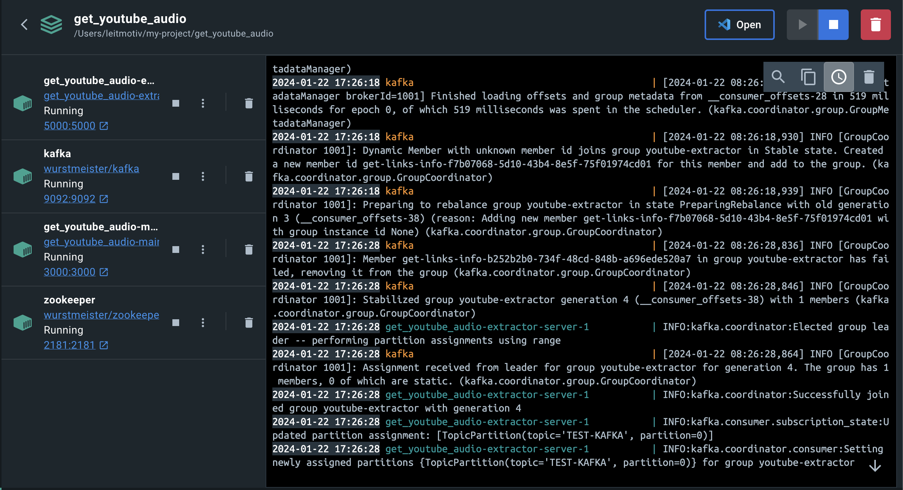
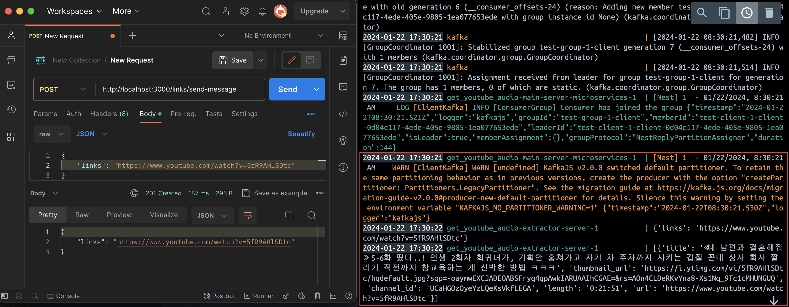

# 카프카로 메시지 전송하기 - Nest.js와 python

> Nest.js에서 유튜브 링크를 python 코드로 작성된 서버에 전송하면 받아서 해당 영상 정보를 출력해주는 간단한 서비스를 구현해 보았다.  
> 이전 글에서는 axios로 http 통신을 통해 정보를 주고 받는 코드를 구현해 보았다.  
> (참조: [https://issuebombom.tistory.com/117](https://issuebombom.tistory.com/117))
>
> 이번에는 주고 받는 것은 아니지만 카프카 메시지 브로커를 중간에 두고서 메시지를 전달하는 코드를 구현해 보았다.

## Kafka란 무엇인가? (간단하게)

어디에선가 받은 이벤트를 잘 보관하고 있다가 구독자에게 이벤트를 잘 전달해주는 `이벤트 브로커`를 말한다.  
이벤트 브로커는 `토픽`이라는 일종의 파일시스템(fs)의 폴더와 같은 저장 공간을 가지고 그 안에 기본적으로 하나의 `파티션`을 갖는다.  
자료를 조사하다 보면 Kafka는 메시지 브로커의 역할도 가능하다고 기록이 되어있는데 다소 혼란스러운 부분이다. 사실 전송하는 방식에 큰 차이는 없는 듯 보였다. 하지만 아키텍처 설계 과정에서 두 서버 간 소통할 때 A 서버에서 발생한 어떠한 `사건`에 대한 알림을 B 서버에게 전달해준다는 개념을 가질 때는 이벤트라고 부르고, A 서버가 B 서버에게 특정한 `정보(데이터)`를 전달해준다는 개념을 가질 때는 메시지라 부르는 듯 하다.  
카프카에 대한 더 자세한 내용은 다른 게시글을 통해 정리하도록 하겠다.

## 카프카 설치

카프카는 아파치 재단에서 제공하는 프로그램이다. 먼저 설치 과정을 살펴보자. 아래 링크로 접속하면 카프카 설치를 위한 tgz 압축 파일을 다운받을 수 있다.  
(참조: [https://kafka.apache.org/downloads](https://kafka.apache.org/downloads))

압축 풀기 및 기본 사용법 또한 아래 링크를 참조하자.  
(참조: [https://kafka.apache.org/quickstart](https://kafka.apache.org/quickstart))

## 기본적인 카프카 사용법

1. 공식문서의 Quick Start를 따라가며 Flow를 생각해보자.카프카 폴더에 접속한다.

```zsh
# 자신이 다운받은 버전에 따라 폴더명이 다를 것이다. # 핵심은 압축 풀기 후 생성된 kafka 폴더를 찾아 들어가는 것이다.
cd kafka_2.13-3.6.1`
```

2.  주키퍼와 카프카를 서로 다른 터미널에서 실행한다.

```zsh
# Start the ZooKeeper
service bin/zookeeper-server-start.sh config/zookeeper.properties

# Start the Kafka broker service
bin/kafka-server-start.sh config/server.properties
```

주키퍼를 우선적으로 실행한 뒤에 카프카를 실행해야 한다. 이 둘은 서로 다른 개별 서버에 해당한다 생각하고 각각 켜 두어야 한다는 것을 기억하자. 또한 기본적으로 localhost:9092포트를 사용하게 되며 이에 대한 변경은 config/server.properties에서 가능하다.  
참고로 주키퍼는 카프카 브로커의 메타데이터를 보관하고 브로커들의 동적 확장, 축소를 담당하는 브로커 관리자에 해당하며 브로커 클러스터의 운영을 돕는다.

3.  새로운 터미널에서 토픽을 생성한다.

```zsh
bin/kafka-topics.sh --create --topic TEST-KAFKA --bootstrap-server localhost:9092
```

kafka-topics.sh 파일을 실행하는데 옵션으로 토픽 생성(토픽 이름으로 'TEST-KAFKA' 지정), localhost:9092로 실행 중인 카프카를 대상으로 생성함을 의미한다.

여기까지 주피커와 카프카 실행 및 토픽 생성을 마쳤다. 이제 본격적으로 해당 브로커에게 메시지를 전달하고 받는 과정을 구현해보자.

## Nest.js에서 카프카에 메시지 전달하기 (producer)

브로커를 가운데 두고서 메시지나 이벤트를 보내는 producer와 이를 구독하는 consumer의 개념이 존재한다. 여기서는 Nest.js가 카프카 producer의 역할을 하고 python 코드 consumer를 구현해 보도록 하자.

먼저 필요한 패키지를 설치해준다.

```zsh
npm install @nestjs/microservices kafkajs
```

### main.ts 설정

main.ts에서 부트스트랩할 때 KAFKA를 이용할 수 있도록 아래와 같이 설정한다.  
이때 카프카 설정 options에서는 nest.js 프레임워크의 글로벌 설정임을 기억하자. 여기서 구체적인 clientId나 groupId를 설정할 수도 있다. 하지만 여러 하위 항목의 여러 컨트롤러나 서비스에서 세부적인 설정이 가능하므로 상황에 맞게 작성하자.

```typescript
// main.ts

import { NestFactory } from '@nestjs/core';
import { AppModule } from './app.module';
import { ValidationPipe } from '@nestjs/common';
import { Transport } from '@nestjs/microservices';

async function bootstrap() {
  const app = await NestFactory.create(AppModule);
  app.connectMicroservice({
    transport: Transport.KAFKA,
    options: {
      // [필수 입력 아님] 옵션은 각 서비스 module에서 세부적으로 지정이 가능하다.
      client: {
        brokers: ['localhost:9092'],
      },
    },
  });

  await app.listen(3000);
}
bootstrap();
```

위 코드는 localhost:3000으로 웹 서비스를 하는 가운데 KAFKA를 이용하는 것에 대한 설정이다. 우리는 엔드포인트 요청을 통해 python consumer에 전달할 초기 메시지를 전달할 것이기 때문이다.  
Nest.js 공식 도큐먼트에 나와있는 카프카 설정은 위와 다를 것이다. 아래와 같이 코드를 작성한다면 해당 서버를 순수 카프카 producer나 consumer로서만 사용하겠다는 의미이다. 그러므로 http를 통한 엔드포인트가 필요하지 않고, 순수 이벤트 기반으로만 사용될 경우 적용하는 코드임을 기억하자(참고)

```typescript
// main.ts (참고)

const app = await NestFactory.createMicroservice<MicroserviceOptions>(AppModule, {
  transport: Transport.KAFKA,
  options: {
    client: {
      brokers: ['localhost:9092'],
    },
  },
});
```

### module, controller, service 설정

모듈 설정을 통해 세부적인 카프카 설정을 진행한다. 특히 clientId, groupId 설정을 왜 하는지 아는 것이 중요하다.  
그룹Id의 경우 컨슈머의 입장에서 그룹화를 의미하며, 컨슈머1과 컨슈머2가 같은 그룹에 속할 수 있음을 의미한다. 이 기능이 필요한 이유 중 하나로 하나의 메시지를 하나의 컨슈머1이 메세지 구독을 혼자 처리하기에 버거워 한다면 컨슈머2를 생성해서 구독을 나눠 가질 수 있도록 하기 위함이다. 이 때 그룹 내 컨슈머는 하나의 파티션에만 접근이 가능하므로 토픽 내에서도 파티션 추가가 필요하다. 그렇게하면 해당 토픽은 메시지를 두 개의 파티션에 분산 저장하게 되어 처리량의 확장, 증대시킬 수 있다.

```typescript
// links.module.ts

import { Module } from '@nestjs/common';
import { LinksController } from './links.controller';
import { LinksService } from './links.service';
import { HttpModule } from '@nestjs/axios';
import { ClientsModule, Transport } from '@nestjs/microservices';
import { LinksKafkaProducerService } from './links.kafka-producer.service';

@Module({
  imports: [
    ClientsModule.register([
      {
        name: 'YOUTUBE_SERVICE', // service의 Inject를 위해 지정하는 이름
        transport: Transport.KAFKA,
        options: {
          client: {
            clientId: 'links-message', // 카프카 클라이언트명을 지정하는 개념, 로깅을 위한 용도
            brokers: ['localhost:9092'],
          },
          consumer: {
            groupId: 'test-group-1', // 컨슈머는 그룹화가 가능하여 그룹명 지정
          },
        },
      },
    ]),
  ],
  controllers: [LinksController],
  providers: [LinksKafkaProducerService],
})
export class LinksModule {}
```

여기서 컨트롤러의 역할은 유튜브 링크에 대한 엔드포인트 요청(POST)이 들어오면 이를 Kafka 브로커에 전달해주는 것이다.

```typescript
// links.controller.ts

import { Body, Controller, Post } from '@nestjs/common';
import { LinksKafkaProducerService } from './links.kafka-producer.service';
import { SendLinksMessageDto } from './dto/send-links-message.dto';

@Controller('links')
export class LinksController {
  constructor(private readonly linksKafkaProducerService: LinksKafkaProducerService) {}

  @Post('/send-message')
  sendMessage(@Body() sendLinksMessageDto: SendLinksMessageDto) {
    this.linksKafkaProducerService.sendMessage({
      topic: 'TEST-KAFKA', // 터미널 명령으로 생성한 토픽 이름을 지정한다.
      message: sendLinksMessageDto,
    });

    return sendLinksMessageDto;
  }
}
```

카프카 producer는 별도의 service로 구현한다.

```typescript
// links.kafka-producer.service.ts

import { Inject, Injectable } from '@nestjs/common';
import { ClientKafka } from '@nestjs/microservices';
import { SendLinksMessageDto } from './dto/send-links-message.dto';

@Injectable()
export class LinksKafkaProducerService {
  constructor(@Inject('YOUTUBE_SERVICE') private readonly clientKafka: ClientKafka) {}

  sendMessage({ topic, message }: ILinksKafkaProducerServiceSendMessage): void {
    const jsonString = JSON.stringify(message); // 오브젝트를 전송하므로 json
    this.clientKafka.emit<SendLinksMessageDto>(topic, jsonString);
  }
}

interface ILinksKafkaProducerServiceSendMessage {
  topic: string;
  message: Record<string, any>;
}
```

이제 Nest.js에서의 카프카 사용을 위한 준비는 끝났다. 여기서는 producer만 구현되었음을 기억하자. 이제 받는 것은 python consumer가 할 것이다.

## Python에서 카프카 메시지 구독하기 (consumer)

파이썬에서 사용하는 kafka 패키지를 설치한다.

```zsh
pip install kafka-python
```

컨슈머 구현은 아래와 같이 간단하게 할 수 있다.  
(참조: [https://kafka-python.readthedocs.io/en/master/](https://kafka-python.readthedocs.io/en/master/))

```python
# app.py

from utils import YoutubeAudioExtractor
from kafka import KafkaConsumer
import json

TOPIC_NAME = "TEST-KAFKA" # 구독할 토픽 지정
GROUP_ID = "youtube-extractor"
CLIENT_ID = "get-links-info"
KAFKA_SERVER = "localhost:9092"

consumer = KafkaConsumer(
    bootstrap_servers=KAFKA_SERVER,
    group_id=GROUP_ID,
    client_id=CLIENT_ID,
    value_deserializer=lambda v: json.loads(v.decode('utf-8'))
)

consumer.subscribe(TOPIC_NAME)

try:
    for message in consumer:
        message = message.value
        links = message['links']

        youtube = YoutubeAudioExtractor(links)
        video_information = youtube.extract_url_information()
        print(video_information)

except Exception as e:
    print({ 'error': f'{e}' })

```

위 코드에서 구독할 토픽을 지정하는 부분, 그리고 value_deserializer를 통해 json 스트링을 dict 형태로 변경하도록 설정하고 있다.  
`YoutubeAudioExtractor` 클래스는 유튜브 영상 링크를 받아 메타데이터를 전달해주는 기능을 한다.  
(참조: [https://issuebombom.tistory.com/117](https://issuebombom.tistory.com/117))

app.py를 실행하면 지정 토픽에 대한 구독 상태에 돌입한다.

## 테스트하기


왼쪽 사진은 Nest.js 서버 실행, 가운데는 파이썬 consumer의 구독 실행, 오른쪽은 kafka에서 실행한 consumer에 해당한다.  
포스트맨을 통해 특정 유튜브 링크를 {"link": "https://...."} 형태의 데이터로 요청한 결과 오른쪽 kafka consumer에서 데이터를 그대로 받았음이 확인되고 있다. 또한 python에서는 받은 링크의 메타데이터를 출력하는 것을 확인할 수 있으며 producer와 consumer가 제 역할을 잘 하고 있음을 확인할 수 있다.

---

# 카프카 컨테이너로 메시지 전송하기 - nest.js, python

Nest.js로 클라이언트에게 유튜브 링크를 입력받으면 이를 카프카 브로커에 메시지로 전송하고, python 라이브러리인 pytube로 해당 링크의 영상 정보를 획득하기 위해 python에서 consumer를 구현하여 메시지를 구독한다.

오늘 핵심 주제는 위 과정을 docker compose를 이용하여 각각 컨테이너로 빌드하여 동작하게 하는 것을 구현하는 과정과 이 과정에서 해결한 문제들에 대해서 알아보자.

컨테이너 없이 로컬 환경에서 간단하게 구현하는 내용은 아래를 참고해 주세요.  
(참조: https://issuebombom.tistory.com/120)

## producer 구현과 컨테이너 빌드 (Nest.js)

지난 게시글에서는 Nest.js 프레임워크에 어울리도록 짜여진 방식으로 producer를 구현했지만 오늘은 순수 kafkajs 라이브러리를 들고서 구현하는 방식을 알아보고 서로 비교해보자.

### kafkajs로 producer 구현

지난 게시글을 작성할 시기에는 nestjs 프레임워크에서 제공하는 브로커 연결 방식에 따라 코드를 구현했었다. 그리고 그 방식의 경우 서버를 실행하면 즉시 카프카와의 연결을 시도했다.

하지만 지속적으로 연결이 유지될 필요가 없는 상황에서는 어떻게 해야하지? 라는 의문이 들었고, 결론적으로 kafkajs를 직접 적용하여 필요에 따라 연결과 종료가 되도록 조금 다른 방식으로 producer를 구현해 보았다.

```typescript
// links.kafka.config.ts
import { Kafka, logLevel } from 'kafkajs';

const kafka = new Kafka({
  clientId: 'test-client-1',
  brokers: ['kafka-1:19092'],
  logLevel: logLevel.ERROR,
});
export const kafkaProducer = kafka.producer();

// links.module.ts
// ...라이브러리 생략
@Module({
  imports: [],
  controllers: [LinksController],
  providers: [
    // 프로바이더 등록
    {
      provide: 'KafkaProducer',
      useValue: kafkaProducer,
    },
    LinksKafkaService,
  ],
})
export class LinksModule {}

// links.kafka.service.ts
// ...라이브러리 생략
@Injectable()
export class LinksKafkaService {
  constructor(
    // producer 등록
    @Inject('KafkaProducer') private readonly producer: Producer
  ) {}

  async sendMessage({ topic, message }: ILinksKafkaServiceSendMessage): Promise<void> {
    await this.producer.connect();
    await this.producer.send({
      topic,
      messages: [{ value: JSON.stringify(message) }],
    });
    await this.producer.disconnect();
  }
}
```

위 코드는 config.ts에서 카프카 연결에 대한 설정을 세팅, 모듈의 프로바이더에 등록, 그리고 이를 서비스에 사용하기 위해 Inject로 주입해 둔 상태이다. 여기까지는 모두 연결을 위한 준비상태이며 실제 연결을 시도하지는 않는다. 이 상태에서 constructor에 등록된 producer가 실제로 사용될 때, 즉 producer.connect() 함수가 실행될 때 연결을 시도하게 된다. 그러므로 sendMessage 함수가 실행될 때에만 연결과 종료를 수행하게 된다.

> `커넥션 유지 vs 필요할 때만 커넥션`
>
> 스트림데이터를 발행하거나 잦은 발행이 요구되는 상황에서는 커넥션을 유지하는 것이 좋다. 잦은 연결, 종료의 반복은 오버헤드에 해당하기 때문이다. 하지만 실시간 처리는 트래픽에 부담을 주는 부분이므로 비즈니스적으로 배치 처리가 허용되는 상황에서는 굳이 실시간성을 유지할 필요가 없을 것이다.

### python으로 consumer 구현

예전에 pytube라는 파이썬 라이브러리를 활용하여 유튜브 링크를 입력하면 해당 영상 정보, 음원, 영상 등을 추출할 수 있는 서비스를 구현한 적이 있어서 이를 활용하고자 nestjs와 python 간 통신을 구현했다.

```python
from utils import YoutubeAudioExtractor
from kafka import KafkaConsumer
import json
import logging
import time

KAFKA_SERVER = ["kafka:19092"]
TOPIC_NAME = "TEST-KAFKA"
GROUP_ID = "youtube-extractor"
CLIENT_ID = "get-links-info"


class Consumer:
    def __init__(self, broker, topic, client_id, group_id):
        self.consumer = KafkaConsumer(
            topic,
            bootstrap_servers=broker,
            value_deserializer=lambda v: json.loads(v.decode("utf-8")),
            client_id=client_id,
            group_id=group_id,
            auto_offset_reset="latest",  # earliest, latest
            # retry_backoff_ms=30000, # 연결 시도 (올바로 작동하지 않음)
            # reconnect_backoff_max_ms=30000, 재연결 시도
            # enable_auto_commit=True, # 오프셋 자동 커밋 여부
            # consumer_timeout_ms=1000 # 데이터 이터레이션을 막는 시간
        )

    def receive_message(self):
        try:
            for message in self.consumer:
                print(message.value)
                links = message.value["links"]
                youtube = YoutubeAudioExtractor(links)
                video_information = youtube.extract_url_information()
                print(video_information, flush=True)  # flush 적용 시 버퍼에 저장된 내용 출력
        except Exception as e:
            print(f"Extract Process Error: {e}")


logging.basicConfig(level=logging.INFO)
logger = logging.getLogger("consumer.conn")

"""카프카 연결 반복 시도
- 카프카 ready 상태에 돌입할 때 까지 연결 재시도
"""
while True:
    try:
        kafkaConsumer = Consumer(KAFKA_SERVER, TOPIC_NAME, CLIENT_ID, GROUP_ID)
        break
    except Exception as e:
        logger.error(f"exception occurred: {e}")
        logger.info("retrying on errors")
        time.sleep(1)
        continue
kafkaConsumer.receive_message()
```

위 코드를 구현하는 과정에서 몇 가지 이슈 사항이 있었다.  
첫째는 컨테이너 기반 파이썬에서 print를 그냥 사용하면 터미널에 출력되지 않는다는 점,  
둘째는 파이썬 카프카 라이브러리에서 카프카 커넥팅을 지속적으로 시도하지 않는다는 점이다.  
위 사항은 해당 프로젝트에 대한 회고 게시글에서 다루도록 하겠다.

### 컨테이너 이미지 빌드하기

```dockerfile
# nodejs build
# main-server
FROM node:18 AS builder
WORKDIR /app
COPY package*.json /app/
RUN npm install

FROM node:18-alpine
WORKDIR /app
COPY --from=builder /app/node_modules/ /app/node_modules/
COPY . .
RUN npm run build
CMD ["node", "dist/main.js"]

# python build
# youtube extractor
FROM python:3.8-alpine
WORKDIR /app
COPY requirements.txt .
RUN pip install -r requirements.txt
COPY . .
CMD python app.py
```

위와 같이 도커 허브에 있는 node와 python 이미지를 적용하여 두 서버 이미지를 빌드했다. 라이브러리 설치를 우선 적용하여 향후 다시 빌드할 때 시간이 단축되도록 작성했다. 최종적으로 docker-compose를 통해 주키퍼, 카프카 이미지와 한꺼번에 컨테이너 생성 및 실행한다.

## 카프카 컨테이너 실행 및 연결

DockerHub에 올라온 가장 많이 접할 수 있었던 주키퍼와 카프카 이미지는 `wurstmeister`와 `conflientinc`였다. 위 둘을 모두 사용에 큰 문제는 없었으나 이미지 크기에서 `wurstmeister`가 약 300MB 가량 더 적었다. 그리고 conflientinc의 카프카가 실행되면 브로커가 준비상태가 되는데까지 시간이 더 오래 걸렸다.

컨테이너 빌드를 위한 yaml 파일을 살펴보자

```yaml
// wurstmeister
version: '2'

services:
  zookeeper:
    image: wurstmeister/zookeeper
    ports:
      - 2181:2181

  kafka-1:
    image: wurstmeister/kafka
    ports:
      - 9092:9092
    environment:
      KAFKA_LISTENERS: LISTENER_DOCKER_INTERNAL://kafka-1:19092,LISTENER_DOCKER_EXTERNAL://kafka-1:9092 # wurstmeister는 listeners와 advertised를 같이 안쓰면 오류를 낸다.
      KAFKA_ADVERTISED_LISTENERS: LISTENER_DOCKER_INTERNAL://kafka-1:19092,LISTENER_DOCKER_EXTERNAL://localhost:9092
      KAFKA_LISTENER_SECURITY_PROTOCOL_MAP: LISTENER_DOCKER_INTERNAL:PLAINTEXT,LISTENER_DOCKER_EXTERNAL:PLAINTEXT
      KAFKA_ZOOKEEPER_CONNECT: zookeeper:2181
      KAFKA_INTER_BROKER_LISTENER_NAME: LISTENER_DOCKER_INTERNAL
    depends_on:
      - zookeeper

// confluentinc
services:
  zookeeper:
    image: confluentinc/cp-zookeeper:7.0.1
    ports:
      - '2181:2181'
    environment:
      ZOOKEEPER_CLIENT_PORT: 2181
      ZOOKEEPER_TICK_TIME: 2000

  kafka-1:
    image: confluentinc/cp-kafka:7.0.0
    ports:
      - "9092:9092"
    environment:
      # confluentinc는 listeners가 없어도 문제되지 않는다.
      KAFKA_ADVERTISED_LISTENERS: LISTENER_DOCKER_INTERNAL://kafka-1:19092,LISTENER_DOCKER_EXTERNAL://localhost:9092
      KAFKA_LISTENER_SECURITY_PROTOCOL_MAP: LISTENER_DOCKER_INTERNAL:PLAINTEXT,LISTENER_DOCKER_EXTERNAL:PLAINTEXT
      KAFKA_INTER_BROKER_LISTENER_NAME: LISTENER_DOCKER_INTERNAL
      KAFKA_ZOOKEEPER_CONNECT: "zookeeper:2181"
      KAFKA_BROKER_ID: 1
      KAFKA_OFFSETS_TOPIC_REPLICATION_FACTOR: 1
    depends_on:
      - zookeeper
```

두 방식에 큰 차이는 없다. 단지 브로커나 파티션 등에 대한 디테일한 세팅을 미리 할 것인가 아닌가에 대한 차이가 있을 뿐이다.

그보다 중요한 점은 `KAFKA_LISTENERS`와 `KAFKA_ADVERTISED_LISTENERS`에 대한 설정이다. 개인적으로 이 부분에서 많이 해맸는데, 이는 컨테이너로 구현된 카프카를 내부와 외부 모두에서 접근이 가능하도록 구현하는 과정에서 해당 옵션에 대한 이해가 필요했기 떄문이다.

### 카프카 컨테이너의 내부와 외부 연결

```yaml
KAFKA_LISTENERS: LISTENER_DOCKER_INTERNAL://kafka-1:19092,LISTENER_DOCKER_EXTERNAL://kafka-1:9092
KAFKA_ADVERTISED_LISTENERS: LISTENER_DOCKER_INTERNAL://kafka-1:19092,LISTENER_DOCKER_EXTERNAL://localhost:9092
KAFKA_LISTENER_SECURITY_PROTOCOL_MAP: LISTENER_DOCKER_INTERNAL:PLAINTEXT,LISTENER_DOCKER_EXTERNAL:PLAINTEXT
KAFKA_INTER_BROKER_LISTENER_NAME: LISTENER_DOCKER_INTERNAL
```

여러 카프카 강의를 보면 다운 받은 kafka 폴더 내 server.properties에서 `listeners`와 `advertised.listeners`의 주석을 풀어주라고 하는데 딱 그 행동을 하는 설정에 해당한다. 이 때 브로커에 접속하기 위한 길을 열어주는 것인다. 위 yaml에서 `LISTENER_DOCKER_INTERNAL`과 `LISTENER_DOCKER_EXTERNAL` 두 가지 케이스가 입력된 것을 볼 수 있다. INTERNAL의 경우 같은 네트워크에 속한 컨테이너 간 통신을 위한 경로에 해당하고 EXTERNAL은 컨테이너 밖 외부와의 연결을 의미한다.

도커 컨테이너는 `docker-compose up`으로 실행할 때 마다 각 컨테이너의 고유 IP주소가 부여되고 이는 실행할 때 마다 바뀐다. 그래서 'kafka-1:19092'와 같이 IP주소 입력 란에 컨테이너명을 입력하면 매번 IP가 바뀌더라도 현재 IP로 접속할 수 있도록 기능이 구현되어있다. 또한 nestjs와 python으로 구현된 producer와 consumer도 컨테이너로 띄우므로 카프카와 동일 네트워크를 사용하여 브로커 접근도 'kafka-1:19092'로 설정해두면 되기 때문에 편리하다.

하지만 도커 환경을 벗어난 외부에서는 'kafka-1'을 알아들을리 만무하고, 설령 해당 컨테이너의 실제 IP를 알고 있어도 네트워크 환경이 다르므로 접속이 불가하다. 그러므로 우선 해당 컨테이너의 네트워크 환경으로 접속해야 하고 yaml의 kafka-1에서 설정한 9092포트로 접속한다. 그러면 우리집IP:9092 -> 컨테이너IP:9092로 포트포워딩된다. 이제는 컨테이너 네트워크 환경이므로 컨테이너IP:9092 = localhost:9092가 된다. 이때 카프카의 advertise.listeners 항목에 localhost:9092를 설정하여 kafka-1:9092로 접속할 수 있게 매칭시켜 두었다면 결론적으로 로컬에서의 localhost:9092가 kafka-1:9092에 다다르게 된다.

> `listeners와 advertised.listeners`
>
> `listeners`는 쉽게 말해 해당 브로커에 접속하기 위한 길을 열어 둔다고 생각하면 좋다. 위 yaml의 경우 kafka-1 호스트의 19092와 9092포트에 대한 접근을 허용하고 있다. `advertised.listeners`는 '광고'라는 키워드를 쓰고 있다. 즉 listeners를 통해 열린 길로 들어오려면 이쪽 경로로 들어오면 됩니다. 라고 외부에 알리는 것이다. 그래서 localhost:9092로 들어오면 kafka-1:9092로 들어올 수 있게 하는 것이다. 이는 LISTENER_DOCKER_INTERNAL와 LISTENER_DOCKER_EXTERNAL로 엮여 있다. 얘네들 형태가 Key:Value임이 보일 것이다. 그래서 listeners의 LISTENER_DOCKER_EXTERNAL과 advertised.listeners의 LISTENER_DOCKER_EXTERNAL이 같은 Key값을 가지므로 엮일 수 있는 것이다.

정리하자면 아래와 같다.

- INTERNAL: 컨테이너끼리는 같은 네트워크 환경이니까 바로 kafka-1 호스트로 접속하면 된다.
- EXTERNAL: 컨테이너 입장에서의 외부 네트워크 환경(우리집 로컬)에서의 접속을 허용하기 위해 로컬 -> 컨테이너 환경 -> 브로커로 포트포워딩한다.

## 컨테이너 실행 및 테스트

```yaml
# docker-compose.yaml
version: '2'

// wurstmeister
version: '2'

services:
  zookeeper:
    image: wurstmeister/zookeeper
    ports:
      - 2181:2181

  kafka-1:
    image: wurstmeister/kafka
    ports:
      - 9092:9092
    environment:
      KAFKA_LISTENERS: LISTENER_DOCKER_INTERNAL://kafka-1:19092,LISTENER_DOCKER_EXTERNAL://kafka-1:9092 # wurstmeister는 listeners와 advertised를 같이 안쓰면 오류를 낸다.
      KAFKA_ADVERTISED_LISTENERS: LISTENER_DOCKER_INTERNAL://kafka-1:19092,LISTENER_DOCKER_EXTERNAL://localhost:9092
      KAFKA_LISTENER_SECURITY_PROTOCOL_MAP: LISTENER_DOCKER_INTERNAL:PLAINTEXT,LISTENER_DOCKER_EXTERNAL:PLAINTEXT
      KAFKA_ZOOKEEPER_CONNECT: zookeeper:2181
      KAFKA_INTER_BROKER_LISTENER_NAME: LISTENER_DOCKER_INTERNAL
    depends_on:
      - zookeeper

  main-server:
    build:
      context: ./main-server
      dockerfile: Dockerfile
    volumes:
      - ./main-server/src:/app/src
    ports:
      - 3000:3000

  extractor-server:
    build:
      context: ./extractor
      dockerfile: Dockerfile
    ports:
      - 5000:5000
    depends_on:
      - kafka
```


### 결과
포스트맨으로 main-server(nestjs) 엔드포인트로 링크를 POST하면 이를 받아 producer에서 메시지를 브로커에 보낸다.



최초 전송 시 카프카에서 버전과 관련된 WARN을 띄우고 있다. 이후 extractor-server(python)에서 즉각적으로 브로커에 담긴 메시지를 가져와 해당 유튜브 영상 정보를 출력하고 있다.


