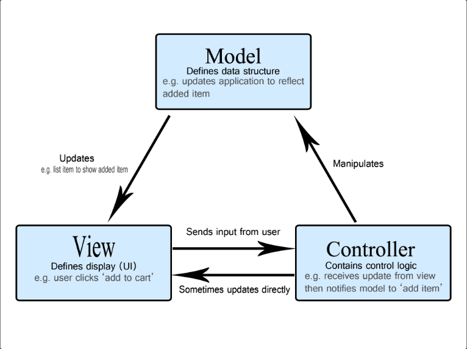

# MVC 패턴에 대한 이해


소스 코드를 MVC(Model-View-Controller) 패턴으로 관리함으로써 코드 관리의 효율성을 높인다.
Model: 데이터와 비즈니스 로직을 관리  
View: 레이아웃과 화면 처리  
Controller: 명령을 모델과 뷰 부분으로 라우팅

## 기존 코드를 MVC 패턴으로 변경하기

프로젝트에서 `models`, `views`, `controllers` 폴더를 생성하여 기능에 따라 분리하여 코드를 관리한다.

### GET, POST 요청 함수를 Controllers로 보내기

`기존 코드`

```javascript
// server.js

const express = require('express');
const PORT = 4000;
const HOST = '0.0.0.0'; // default, 안적어도 됨
const app = express();

// 유저 데이터
const Users = [
    {
        id: 0,
        name: 'Jack',
    },
    {
        id: 1,
        name: 'Jennifer',
    },
];

// 미들웨어 (body parser)
app.use(express.json());

// 미들웨어 (logger)
app.use((req, res, next) => {
    const start = Date.now();
    console.log(`start: ${req.method} ${req.url}`);
    next();
    const diffTime = Date.now() - start;
    console.log(`end: ${req.method} ${req.url} ${diffTime}ms`);
});

// Users GET
app.get('/users', (req, res) => {
    res.send(Users);
});

// User GET
app.get('/users/:userId' (req, res) => {
    const userId = Number(req.params.userId);
    const user = Users.find((user) => user.id === userId);
    if (user) {
        res.json(user);
    } else {
        res.sendStatus(404);
    }
});

// Users POST
app.post('/users', (req, res) => {
	if (!req.body.name) {
        return res.status(400).json({ error: 'Missing user name' });
    }

    const newUser = {
        name: req.body.name,
        id: Users.length,
    };
    Users.push(newUser);
    res.json(newUser);
});

app.listen(PORT, HOST, () => {
    console.log(`Running on port ${PORT}`);
});
```

> `들어가기전`  
> 미들웨어 logger의 역할은 두가지이다.
>
> 1. 요청을 받은 시점과 task가 끝난 시점의 CRUD 형태와 pathname의 정보를 제공한다.
> 2. 요청을 받은 뒤 task를 시작한 시점부터 리스폰하기 까지의 시간을 측정한다.

---

기존 코드에서는 데이터에 대한 정보, 각 요청에 따른 리스폰을 한군데에 모아 두고 있다.  
여기서 먼저 request가 들어왔을 시 response 처리를 위한 코드를 분리한다.

> `Step 1`  
> `controllers` 디렉토리에 `users.controllers.js` 파일을 생성  
> req, res 처리 부분을 함수로 만들어 users.controllers.js에 보관  
> 생성된 함수를 module.exports를 통해 server.js로 보내준다.

`변경된 코드` (users.controllers.js)

```javascript
// users.controllers.js

function getUsers(req, res) {
    res.send(Users);
}

function getUser(req, res) {
    const userId = Number(req.params.userId);
    const user = Users.find((user) => user.id === userId);
    if (user) {
        res.json(user);
    } else {
        res.sendStatus(404);
    }
}

function postUser(req, res) {
    if (!req.body.name) {
        return res.status(400).json({ error: 'Missing user name' });
    }

    const newUser = {
        name: req.body.name,
        id: Users.length,
    };
    Users.push(newUser);
    res.json(newUser);
}

// 해당 함수를 외부에 공개한다.
module.exports = {
    getUsers,
    getUser,
    postUser,
};
```

유저 정보에 대한 GET, POST 요청 부분을 `getUsers`, `getUser`, `postUser` 함수로 대체하여 생성하였다. 앞으로 users에 대한 API 요청 컨트롤 부분은 해당 파일에서 관리한다.

> `Step 2`  
> server.js에서 users.controllers.js를 require  
> (req, res) 부분을 함수로 대체한다.

`변경된 코드` (server.js)

```javascript
// server.js

const express = require('express');

// (추가된 부분)
const usersController = require('./controllers/users.controller');

const PORT = 4000;
const HOST = '0.0.0.0';
const app = express();

// 유저 데이터
const Users = [
    {
        id: 0,
        name: 'Jack',
    },
    {
        id: 1,
        name: 'Jennifer',
    },
];

// 미들웨어 (body parser)
app.use(express.json());

// 미들웨어 (logger)
app.use((req, res, next) => {
    const start = Date.now();
    console.log(`start: ${req.method} ${req.url}`);
    next();
    const diffTime = Date.now() - start;
    console.log(`end: ${req.method} ${req.url} ${diffTime}ms`);
});

// (수정된 부분) req, res 코드 부분 간소화
app.get('/users', usersController.getUsers); // Users GET
app.get('/users/:userId', usersController.getUser); // User GET
app.post('/users', usersController.postUser); // Users POST

app.listen(PORT, HOST, () => {
    console.log(`Running on port ${PORT}`);
});
```

users.controller.js 를 require하여 `usersController` 변수에 담아 객체의 메소드와 같이 불러서 사용함을 볼 수 있다.

### 데이터베이스(리소스)를 Models로 보내기

유저 정보는 Models 폴더 내에서 관리한다. 현재 예시는 아주 간단한 데이터 형태로 되어있으나 향후 MySQL이나 MongoDB 같은 데이터베이스가 연동할 때는 조금 더 복잡해 진다.

> `Step 1`  
> `models` 디렉토리에 `users.model.js` 파일을 생성  
> 해당 파일에 데이터를 보관  
> `module.exports`로 데이터 변수를 외부에 공개한다.

`생성된 코드` (users.model.js)

```javascript
// users.model.js

const Users = [
    {
        id: 0,
        name: 'Jack',
    },
    {
        id: 1,
        name: 'Jennifer',
    },
];

module.exports = Users;
```

> `Step 2`  
> controllers에서 데이터를 다룰 수 있도록 model을 require  
> 기존에 데이터 변수로 쓰던 Users를 model로 변경

`수정된 코드` (users.controllers.js)

```javascript
/// users.controllers.js

// (추가된 부분)
const model = require('../models/users.model');

function getUsers(req, res) {
    res.send(model); // Users -> model
}

function getUser(req, res) {
    const userId = Number(req.params.userId);

    // Users -> model
    const user = model.find((user) => user.id === userId);
    if (user) {
        res.json(user);
    } else {
        res.sendStatus(404);
    }
}

function postUser(req, res) {
    if (!req.body.name) {
        return res.status(400).json({ error: 'Missing user name' });
    }

    const newUser = {
        name: req.body.name,
        id: model.length, // Users -> model
    };
    model.push(newUser); // Users -> model
    res.json(newUser);
}

module.exports = {
    getUsers,
    getUser,
    postUser,
};
```

이렇게하여 users 요청에 대한 Controller 부분과 데이터 부분을 분리할 수 있다. 향후 특정 유저에 대한 댓글, 포스트에 대한 요청이 있다면 위와 같은 방식으로 controllers 파일을 추가 생성하여 관리하면 된다.

### 라우터 생성하기

server.js파일에도 `app.get`, `app.post`와 같은 요청코드도 프로젝트 규모에 따라 그 종류가 다양해지면서 길게 쌓일 수 밖에 없게 된다. 그러므로 이를 관리하기 위한 디렉토리를 따로 관리하는데 이를 `routes` 디렉토리에서 관리한다.  
그래서 라우터 객체를 생성해 미들웨어를 통해 앞으로 routes 디렉토리와 소통하도록 한다.

과정을 간략히 정리하자면 아래와 같다.

```javascript
// user.router.js
// express.Router 객체 생성
const userRouter = express.Router();

// 경로에 따른 라우터 등록
userRouter.get('/', usersController.getUsers);
userRouter.get('/:userId', usersController.getUser);
userRouter.post('/', usersController.postUser);

/*-----------------------------*/
// server.js
// 미들웨어로 라우터 등록
app.use('/users', userRouter);
```

그래서 '/users'에 대한 요청이 들어오면

1. server.js의 미들웨어에서 '/users'에 대해 userRouter로 이동
2. userRouter에서 PATH의 형태와 GET, POST에 맞는 response 함수로 이동
3. users에 대한 response 함수인 usersController로 이동한다.

> `Step 1`  
> `routes` 디렉토리 생성 후 `user.router.js`파일을 생성  
> 아래와 같이 코드를 작성한다.

```javascript
// users.router.js

const express = require('express');
const usersRouter = express.Router();
const usersController = require('../controllers/users.controller');

usersRouter.get('/', usersController.getUsers);
usersRouter.get('/:userId', usersController.getUser);
usersRouter.post('/', usersController.postUser);

module.exports = usersRouter;
```

express.Router 객체를 생성하여 server.js에서 전달받은 '/users' path에 대한 다음 path를 Router에서 분기하여 Controller에 전달하는 것을 확인할 수 있다.  
Router 사용과 Controller 연결을 위한 require 설정, 그리고 server.js와의 연결을 위한 module.exports 설정을 이해해야한다.

이제 server.js는 어떻게 수정되어야 할지 확인해보자.

```javascript
/// server.js

const express = require('express');
const usersRouter = require('./routes/users.router'); // (추가된 부분)
const PORT = 4000;
const HOST = '0.0.0.0';

const app = express();

// 미들웨어 (body parser)
app.use(express.json());

// 미들웨어 (logger)
app.use((req, res, next) => {
    const start = Date.now();
    console.log(`start: ${req.method} ${req.url}`);
    next();
    const diffTime = Date.now() - start;
    console.log(`end: ${req.method} ${req.baseUrl}${req.url} ${diffTime}ms`);
});

// (수정된 부분) 기존에 비해 간소화 된 것을 확인할 수 있다.
app.use('/users', usersRouter);

app.listen(PORT, HOST, () => {
    console.log(`Running on port ${PORT}`);
});
```

routes 디렉토리를 통해 '/users'에 대한 요청을 users.route.js에 분기했기 때문에 server.js에서는 app 요청을 간소화할 수 있다.

추가적으로 logger 부분에 req.baseUrl을 추가하였는데 살펴보자

```javascript
// 미들웨어 (logger)
app.use((req, res, next) => {
    const start = Date.now();
    console.log(`start: ${req.method} ${req.url}`);
    next();
    const diffTime = Date.now() - start;
    console.log(`end: ${req.method} ${req.baseUrl}${req.url} ${diffTime}ms`);
});
```

미들웨어에서 `next()`에 도달하면 main task를 포함한 여러 task를 처리한 뒤 next() 뒷 부분이 실행됩니다. 여기서 라우터를 거치는 바람에 req.url은 최종 path에 대한 기록만 남게 되어 `${req.baseUrl}`를 통해 기존 path도 함께 표시하도록 조치했다.

만약 `${req.baseUrl}`를 붙여쓰지 않는다면 'users/1' 요청의 로그가 아래와 같이 '/1'만 남게된다. 로그를 정확하게 남기기 위해 위와 같은 조치를 취한다.

```bash
# before
start: GET /users/1
end: GET /1 8ms

# after
start: GET /users/1
end: GET /users/1 8ms
```

## 정리

server.js 하나의 파일에서 전부 작업하던 것에서 벗어나 `Model(데이터 처리 부분)`, `View(보여지는 부분)`, `Controller(요청에 대한 Task 부분)`과 추가적으로 `Route(pathname 분기)`를 적용하여 Task를 MVT 기준에 따라 세부적으로 분할하여 관리하는 기법을 살펴보았다.  
View 부분은 웹 서버 API를 통해 html의 레이아웃을 담당하는 부분인데 추후 내용 추가할 예정이다.
MVC 패턴을 통해 기능 분리를 구현할 수 있으며 이는 업무 효율성을 높여준다.(고 하지만 사람에 따라 차이가 있을 것 같다.)
